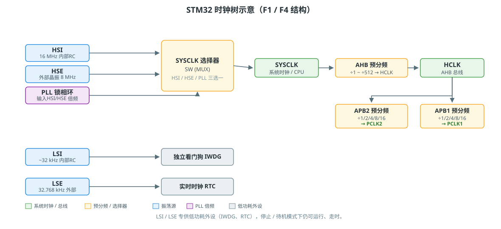

# STM32 时钟系统：五个时钟源

> STM32 的时钟源按「谁来产生」分三类：**内部 RC**、**外部晶振**、**PLL 倍频**。内部 RC 开机就能用但不准，外部晶振准但要多等起振，PLL 靠倍频把慢源变成高速系统时钟。本文用 F1/F4 的结构讲清楚，寄存器名与配置步骤以 HAL 为准。

## 一、五个时钟源一览

| 时钟源 | 全称 | 频率 | 类型 | 用途 |
| ------ | ---- | ---- | ---- | ---- |
| **HSI** | High-Speed Internal | 16 MHz（F4）/ 8 MHz（F1） | 内部 RC | 上电默认，精度 ~1%，可校准 |
| **HSE** | High-Speed External | 4~26 MHz（常用 8 MHz） | 外部晶振/有源时钟 | 精确，配 PLL 做系统时钟的主力源 |
| **PLL** | Phase-Locked Loop | 最高可达系列上限（如 F407 到 168 MHz） | 倍频电路 | 把 HSI/HSE 倍频成高速系统时钟 |
| **LSI** | Low-Speed Internal | ~32 kHz | 内部 RC | 独立看门狗 IWDG、低功耗唤醒 |
| **LSE** | Low-Speed External | 32.768 kHz | 外部晶振 | RTC 走时，掉电后仍能走 |

!!! tip "怎么记"
    **HS** = 给 CPU/外设跑的高速源，**LS** = 给看门狗/RTC 用的低速源，**I** = 芯片内部自带，**E** = 要外接晶振。

## 二、时钟树总览



一条主干：**SYSCLK 选择器（SW）** 在 HSI / HSE / PLL 中三选一 → 过 AHB 预分频得到 HCLK（CPU 和总线频率）→ 再过 APB1 / APB2 预分频得到外设时钟。低速源（LSI/LSE）走的是另一条独立支路，不参与系统时钟。

关键寄存器：

| 寄存器 | 作用 |
| ------ | ---- |
| `RCC_CR` | 各时钟源开关 + 就绪标志（HSERDY、PLLRDY…） |
| `RCC_CFGR` | SW 选择、AHB/APB 预分频、PLL 参数 |
| `RCC_PLLCFGR`（F4） | PLL 的 N/M/P/Q 分频系数 |

!!! warning "查频率为什么不是直接读一个寄存器"
    时钟树有 N 个分频点，系统把每个分频系数（HSI/HSE/PLL、SW、HPRE、PPRE…）都摊开在几个寄存器里。**从寄存器读不到"当前时钟频率"，只能读出"分频系数"**，所以拿代码读时钟，本质是把分频系数取出来按公式算一遍。

## 三、怎么选：HSI / HSE / PLL

- **HSI**：上电复位后默认走它，不接晶振也能跑。但精度差、温漂大，串口波特率对不上、USB 枚举失败这类问题，多半是它在背锅。做演示可以，量产别依赖。
- **HSE**：精度的来源，所以外接晶振配 PLL 是标准做法。注意两块板子晶振不同，PLL 参数就得跟着改，否则超频或降频。
- **PLL**：系统跑 72/168 MHz 这类高速，全靠它把 8 MHz 的 HSE 倍频上去。倍频后要**先等 PLLRDY 置位再切换**，切太快会直接跑飞。

## 四、可执行的代码：获取系统时钟

三种读时钟函数（F1/F4 的 HAL 都带，函数名略有差异，实现思路相同）：

```c
// 头文件里已带声明：stm32f1xx_hal_rcc.h / stm32f4xx_hal_rcc.h
uint32_t HAL_RCC_GetSysClockFreq(void);   // SYSCLK
uint32_t HAL_RCC_GetHCLKFreq(void);       // HCLK = AHB 总线时钟
uint32_t HAL_RCC_GetPCLK1Freq(void);      // PCLK1 = APB1 外设时钟
uint32_t HAL_RCC_GetPCLK2Freq(void);      // PCLK2 = APB2 外设时钟
```

在 `main()` 里直接调用即可：

```c
#include "stm32f1xx_hal.h"   /* 或 stm32f4xx_hal.h，以工程为准 */

int main(void) {
    HAL_Init();

    uint32_t sysclk = HAL_RCC_GetSysClockFreq();
    uint32_t hclk   = HAL_RCC_GetHCLKFreq();
    uint32_t pclk1  = HAL_RCC_GetPCLK1Freq();
    uint32_t pclk2  = HAL_RCC_GetPCLK2Freq();

    /* 用调试器或串口把这几个值打出来，对着 CubeMX 的 Clock 页面核对 */
    /* sysclk = 72 MHz, hclk = 72 MHz, pclk1 = 36 MHz, pclk2 = 72 MHz（F103 典型值） */

    while (1);
}
```

!!! tip "代码去哪找"
    工程生成的 `main.c` 里会有一句 `HAL_RCC_GetSysClockFreq()` 被 CubeMX 调用（时钟初始化完成后打日志用），搜工程就能看到这三个函数真正的实现——它们按 `RCC_CFGR` 里读出的分频系数回溯计算，能看懂它 = 看懂时钟树。

## 五、三个常用配置函数（HAL）

```c
/* 1. 使能时钟源并等待就绪 */
__HAL_RCC_HSI_ENABLE();
while (!__HAL_RCC_GET_FLAG(RCC_FLAG_HSIRDY));

/* 2. 配置 PLL 并等待就绪（F1 为例，PLL 从 HSE 8MHz 倍频到 72MHz） */
RCC_PLLConfig(RCC_PLLSource_HSE_Div1, RCC_PLLMul_9);   /* 8 MHz × 9 = 72 MHz */
while (!__HAL_RCC_GET_FLAG(RCC_FLAG_PLLRDY));

/* 3. 把 PLL 切到 SYSCLK 选择器，并等切换完成 */
RCC_SYSCLKConfig(RCC_SYSCLKSource_PLLCLK);
while (RCC_GetSYSCLKSource() != 0x08);
```

!!! warning "典型踩坑"
    - F1 的 `RCC_PLLMul_9` 这类**系数是宏，不是寄存器值**，配置前先查头文件。
    - 切到 PLL 前必须确保 PLLRDY 已置位，否则直接跑飞（`while(1)` 死等不是「卡住」，是保护）。
    - 使能电源接口时钟的先后顺序，见 [stm32-notes.md](stm32-notes.md) 的时钟配置问题一节。

## 参考

- ST 官方参考手册：`RM0008`（F1）/ `RM0090`（F4）— RCC 章节就是完整时钟树
- 本文时钟树图为示意，具体分频系数与上限以对应型号参考手册为准
